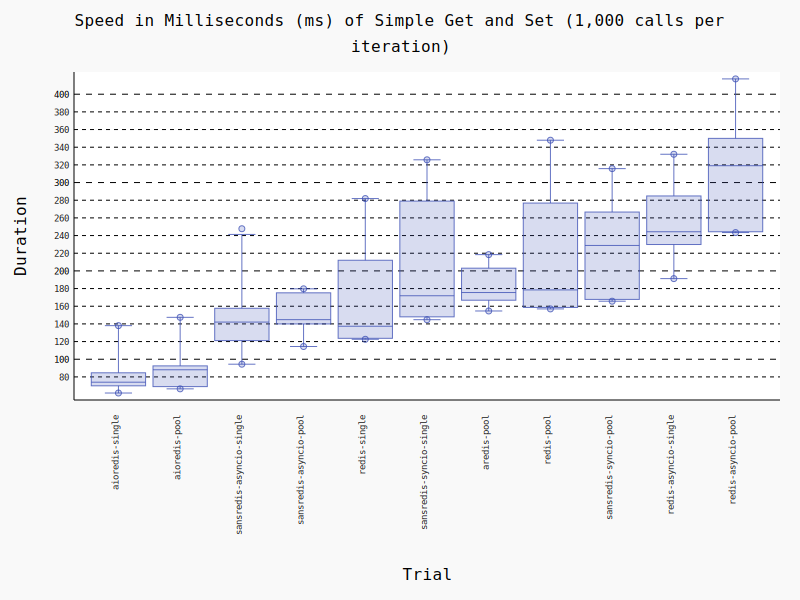

# Sans-IO Redis

## What is this?

This repository was inspired by [Sans-IO Python](https://sans-io.readthedocs.io/) as 
an attempt to implement an event-based backend for reading and writing bytes which 
conform to the Redis Client/Server Protocol.

As our community evolves to work with varied IO implementations, we need to 
re-approach our client libraries in a way which will ease the maintenance burden for 
duel support. This respository is meant to serve as a starting point for creating a 
more robust, maintainable Python client for Redis.

## Organization

The core business logic of the library is held within the `sansio` package. All 
configuration, error modes, core connection operations, command encoding and 
response decoding is contained within this module, which is intentionally free of 
any IO-specific logic.

There are two more top-level packages: `io` and `client`.

The `io` package contains IO-specific implementations of connections and connection 
pools over TCP and UFD sockets for asyncio and standard sync io. These 
implementations make use of the high-level `SansIORedisProtocol` to maintain the 
query/response lifecycle.

The `client` package is similarly organized to the `io` module, but provides a 
partial implementation of a high-level client which mirrors the interface found in 
the popular redis/redis-py library.

## Not Implemented

`MONITOR` and `PUB/SUB` are not yet implemented, as these require a custom 
connection protocol which opens a stream with a single command then continually 
receives responses from the server.

Additionally, only the core redis commands are implemented reliably.

## Benchmarks

### Table

|  **Name (time in ms)**   |     **Min**     |     **Max**     |    **Mean**     |   **StdDev**   |   **Median**    |     **IQR**     | **Outliers** |    **OPS**     | **Rounds** | **Iterations** |
|:------------------------:|:---------------:|:---------------:|:---------------:|:--------------:|:---------------:|:---------------:|:------------:|:--------------:|:----------:|:--------------:|
|     aioredis-single      |  56.6903 (1.0)  | 115.1984 (1.0)  |  78.3431 (1.0)  | 16.0457 (1.0)  |  75.4108 (1.0)  |  16.4435 (1.0)  |     5;1      | 12.7644 (1.0)  |     14     |       1        |
|      aioredis-pool       | 64.4246 (1.14)  | 148.7113 (1.29) | 92.4804 (1.18)  | 22.7165 (1.42) | 89.2427 (1.18)  | 21.7655 (1.32)  |     3;1      | 10.8131 (0.85) |     12     |       1        |
| sansredis-asyncio-single | 88.1866 (1.56)  | 184.7921 (1.60) | 127.5533 (1.63) | 34.9346 (2.18) | 116.3765 (1.54) | 66.9425 (4.07)  |     4;0      | 7.8399 (0.61)  |     10     |       1        |
|  sansredis-asyncio-pool  | 106.3971 (1.88) | 169.7618 (1.47) | 140.7417 (1.80) | 27.4685 (1.71) | 152.2438 (2.02) | 46.6729 (2.84)  |     2;0      | 7.1052 (0.56)  |     5      |       1        |
|       redis-single       | 122.2055 (2.16) | 288.6840 (2.51) | 171.7278 (2.19) | 59.4366 (3.70) | 149.2271 (1.98) | 78.8840 (4.80)  |     1;0      | 5.8232 (0.46)  |     8      |       1        |
|       aredis-pool        | 157.1956 (2.77) | 224.1104 (1.95) | 178.0331 (2.27) | 26.4005 (1.65) | 170.6083 (2.26) | 21.0777 (1.28)  |     1;1      | 5.6169 (0.44)  |     5      |       1        |
|  sansredis-syncio-pool   | 160.5175 (2.83) | 307.3941 (2.67) | 217.8067 (2.78) | 71.5797 (4.46) | 169.3268 (2.25) | 123.5731 (7.51) |     1;0      | 4.5912 (0.36)  |     5      |       1        |
| sansredis-syncio-single  | 162.8764 (2.87) | 325.2775 (2.82) | 235.4209 (3.00) | 65.8469 (4.10) | 222.2372 (2.95) | 124.0206 (7.54) |     4;0      | 4.2477 (0.33)  |     7      |       1        |
|        redis-pool        | 164.8384 (2.91) | 365.8405 (3.18) | 223.7603 (2.86) | 77.7456 (4.85) | 196.7757 (2.61) | 81.6743 (4.97)  |     1;0      | 4.4691 (0.35)  |     6      |       1        |
|   redis-asyncio-single   | 191.5593 (3.38) | 267.2914 (2.32) | 222.8331 (2.84) | 36.6610 (2.28) | 199.9841 (2.65) | 64.5875 (3.93)  |     1;0      | 4.4877 (0.35)  |     5      |       1        |
|    redis-asyncio-pool    | 250.9880 (4.43) | 375.6802 (3.26) | 305.1609 (3.90) | 52.4728 (3.27) | 318.1548 (4.22) | 84.2766 (5.13)  |     2;0      | 3.2770 (0.26)  |     5      |       1        |

### Histogram

